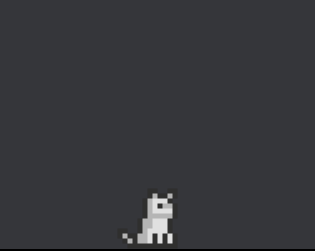

**Description:**

Just a little friend who hangs out on the bottom of your screen, plain and simple!

I just code for a hobby and wrote this as a distraction, so it is far from optimized. Please be patient with any issues or lack of features, and leave a comment down below if you'd like to see any further work on this!

I'm very thankful for the wonderful art at Elthen's Pixel Art Shop and  their generous use polices! Check it out: https://elthen.itch.io/

Please note that this will only function on Windows.

**Features:**

* A small, pixelated, animated cat that stands on the bottom of your screen hanging out, walking around, and going through several behaviors in a random manner.
* Borderless, transparent window, always on top and does not interfere with other open windows.
* You can left-click and drag to move the cat.
* You can right-click for a special interaction.
* Middle-click closes the application.

**Plans:**

* Better interaction with Windows taskbar.
* More interactions.
* Startup customization options?
* More animations?

**Download Instructions:**

* Simply download the zip file and run the executable!
